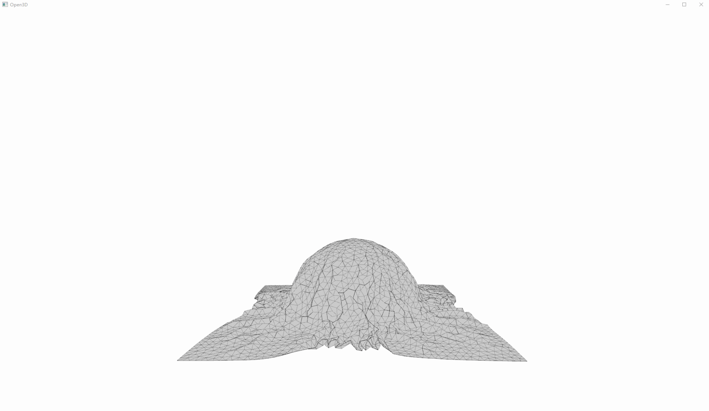
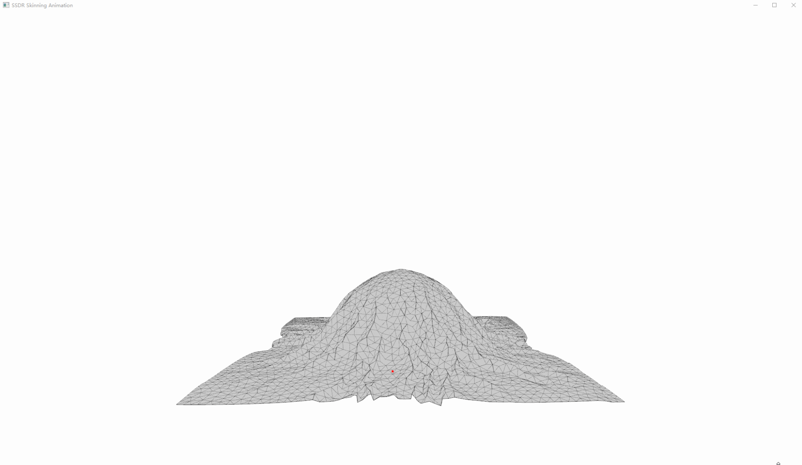

# Smooth Skinning Decomposition with Rigid Bones (SSDR)

This repo implements **SSDR** (Le & Deng, SIGGRAPH Asia 2012) in pure Python/NumPy  
to extract bone transforms and skinning weights from a sequence of meshes.

这个仓库是对 SSDR（Le & Deng, SIGGRAPH Asia 2012）论文算法的最简 Python/NumPy 实现，
用于从网格动画序列中提取骨骼变换和蒙皮权重。




## Installation
**This project requires Python 3.10. Other python versions are not tested.**

### 1. Clone the repository 克隆仓库：
```
git https://github.com/DMTyler/Project_SSDR.git
cd Project_SSDR
```
### 2. Install dependencies 安装依赖:
```
pip install -r requirements.txt
```

## Python Usage
This project accepts a `.npz` file as input, containing a vertex animation sequence. 
The SSDR optimization results (rest pose, weights, and bone transformations) 
are then exported as another `.npz` file.

本项目以 `.npz` 格式输入顶点动画，输出 SSDR 骨骼动画结果，依然以 `.npz` 格式保存。

### Input Format
**The input `.npz` file is expected to contain key value pairs where:**
 - V: (F, N, 3) array of vertex positions over F frames.
 - P: (N, 3) array of rest-pose vertices. If not provided, the first frame of V is used as rest pose (Optional).
 - F: (M, 3) array of triangle indices for mesh visualization (Optional).

**输入 .npz 文件需包含如下键值对：**
 - V: (F, N, 3) 网格动画序列（必需）
 - P: (N, 3) 初始静态姿态（可选，默认为第一帧）
 - F: (M, 3) 三角面拓扑（可选，仅用于可视化）

### Output Format
**The output `.npz` file will contain key value pairs where:**
 - P: (N, 3) refined rest-pose vertices.
 - W: (N, B) vertex-bone weights.
 - R: (B, F, 3, 3) bone rotations per frame.
 - T: (B, F, 3) bone translations per frame.

**输出 `.npz` 文件包含如下键值对：**
 - P: (N, 3) 精化后的 rest pose 顶点
 - W: (N, B) 每个顶点对应骨骼的权重
 - R, (B, F, 3, 3) 每帧每个骨骼的旋转
 - T: (B, F, 3) 每帧每个骨骼的平移

### Main Entries
**There are two main Python scripts for interacting with the system:**
 - `bake_main.py`: Performs SSDR optimization and exports bone animation.
 - `play_main.py`: Visualizes either vertex animation or bone-driven skinning.

项目有两个主入口文件，`bake_main.py` 负责进行 SSDR 优化，`play_main.py` 负责播放顶点或者骨骼动画。

**Both scripts contain two key global variables:**
 - `ORIGINAL_PATH`: path to the input `.npz` vertex animation.
 - `EXPORT_PATH`: path to the output `.npz` baked SSDR animation.

可修改主入口文件中的`ORIGINAL_PATH`与`EXPORT_PATH`两个路径变量指定程序的 I/O 路径。

## Houdini Usage

**This project requires Houdini 20.5. Other houdini versions are not tested.**


This project supports exporting vertex animations (with unchanged mesh topology) 
directly from Houdini to `.npz` format suitable for SSDR optimization, 
with houdini data asset `sop_dm_tyler.export_npz.0.1.hda`.

这个项目支持将 网格拓扑结构不变 的顶点动画，直接从 Houdini 导出为适用于 SSDR 优化的 `.npz` 文件
（使用 `sop_dm_tyler.export_npz.0.1.hda` 节点）。

Check sample houdini project `sample_vellum.hip` for detailed usage example.

可参考示例工程 `sample_vellum.hip` 了解用法。


## Reference

Le, B., & Deng, Z. (2012). *Smooth Skinning Decomposition with Rigid Bones.* ACM Transactions on Graphics (SIGGRAPH Asia), 31(6), 199:1–199:10.
doi: https://doi.org/10.1145/2366145.2366218.
